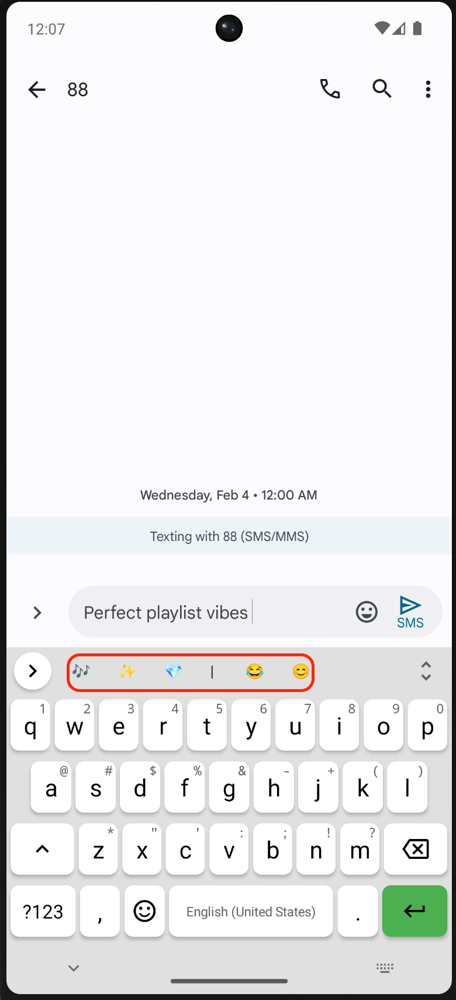

# ⌨️ EmojiBoard


A custom Android keyboard that reads the emotional context of what you're typing and suggests relevant emojis — entirely on your device, no internet required.

Built on top of the excellent open-source [FlorisBoard](https://github.com/florisboard/florisboard) keyboard by Patrick Goldinger, with a deep learning layer added on top.

---

## What it does

Most emoji suggestions on keyboards are keyword-based — they show 🔥 when you type "fire". This is different. EmojiBoard uses a fine-tuned **Twitter-RoBERTa-base** Transformer model to understand the *sentiment and emotion* behind your sentence as a whole, not just individual keywords.

Type something sarcastic, romantic, frustrated, or excited — and the keyboard picks up on it.

The top emoji suggestions appear live above the keyboard as you type, updating with every word.

---

## Features

- **Emotion-aware suggestions** — understands joy, sadness, anger, love, fear, surprise, sarcasm, and more
- **Two-model pipeline** — one model handles emoji prediction, another handles sentiment classification, both running in parallel
- **Completely offline** — your keystrokes never leave your phone
- **Handles similar emojis correctly** — differentiates between 😂 and 🤣, ❤️ and 🥰, using Label Smoothing and Hard Example Mining during training
- **Sub-200ms inference** — both models are quantized TFLite graphs, fast enough to run in real-time on mobile CPUs

---

## Screenshot

| Typing | 
| :---: | 
|  | 


---

## How the Model works

The model was trained on a 100k+ real-world messaging dataset sourced from Twitter. Here's the training pipeline:

1. **Base model:** Started with `cardiffnlp/twitter-roberta-base` — a RoBERTa model already pre-trained on 58M tweets, which gives it a strong grasp of how people actually text
2. **Layer freezing:** Bottom 8 encoder layers were frozen to preserve general English understanding and prevent catastrophic forgetting
3. **Class imbalance fix:** Clipped Class Weights were applied — some emojis appear way more than others in real data, so without this the model just predicts 😂 for everything
4. **Hard example mining (OHEM):** Focused training on the samples the model was most confused about, especially semantically similar emojis
5. **Export pipeline:** PyTorch → TensorFlow → TFLite (quantized INT8), which reduced model size significantly and made on-device inference practical

The sentiment model runs alongside the emoji model to provide a second opinion on emotional tone, especially useful for ambiguous sentences. It classifies text into 11 emotions :- joy, love, anger, sadness, fear, surprise, disgust, optimism, pessimism, anticipation, and trust maps each to a curated set of 3 emojis, so even when the main model is uncertain, the suggestions still feel emotionally right.

---

## Installation

### Prerequisites
- Android Studio Giraffe or newer
- Minimum SDK: API 26 (Android 8.0)
- Target SDK: API 34 (Android 14)

### Build from source

```bash
git clone https://github.com/konathambharath2003/EmojiBoard.git
```

1. Open the project in Android Studio
2. Let Gradle sync and download dependencies
3. Make sure `emoji_model.tflite` and `sentiment/sentiment_model.tflite` are present in `app/src/main/assets/`
4. Hit **Run** to build and install on your device or emulator

### Enable the keyboard on your phone

1. Go to **Settings → System → Languages & input**
2. Tap **On-screen keyboard → Manage on-screen keyboards**
3. Toggle **EmojiBoard** on
4. Open any app, tap the keyboard switcher icon, and select EmojiBoard
5. Start typing — emoji suggestions will appear above the keys

---

## Project structure

The two core files added on top of FlorisBoard are:

- `EmojiPredictor.kt` — loads the emoji TFLite model, runs tokenization, returns top-3 predictions
- `SentimentPredictor.kt` — loads the sentiment TFLite model, maps output to emotion categories and emoji groups

Everything else is standard FlorisBoard — theming, settings, glide typing, clipboard manager, etc. all work as usual.

---

## Based on FlorisBoard

This project would not exist without [FlorisBoard](https://github.com/florisboard/florisboard), a beautifully built open-source keyboard by [Patrick Goldinger](https://github.com/patrickgold). EmojiBoard adds an AI layer on top of it but inherits all of FlorisBoard's core keyboard functionality.

FlorisBoard is licensed under the Apache License 2.0. All original copyright belongs to Patrick Goldinger.

---


